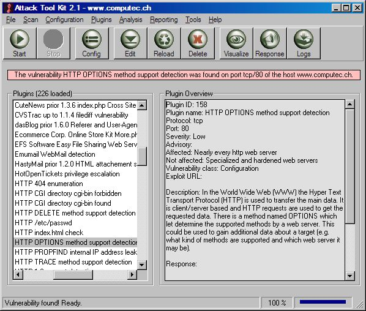



## Attack Tool Kit 2\.1

### Description

The acronym ATK stands for Attack Tool Kit. It was first developed to provide a very small and handy tool for Windows to realize simple security checks. But more and more the utility grows and allows in the meanwhile to do full security audits as like other vulnerability scanners are able to do (e.g. Nessus or ISS Internet Scanner). But this is not the main goal of the tool. The primary task is to allow small and fast checks for dedicated vulnerabilities. The special thing about ATK is that the tool is able to do the work without great interaction. But there is also always the possibility to vary and change the behaviour of the software. This concern the plugins, checking, enumeration and reporting. The user is not dependent of the ideas of the developers - If needed because of the modularity nearly every change can be done within a few seconds. ATK is absolutely free to use and distribute. The software is written in Visual Basic and underlies the General Public License (GPL). The official project web site can be found at http://www.computec.ch/projekte/atk/
 
### More Info
 
Do not scan a ressource without permission!

             |
---                |---
**Submitted On**   |2004-09-09 13:00:34
**By**             |[Marc Ruef](https://github.com/Planet-Source-Code/PSCIndex/blob/master/ByAuthor/marc-ruef.md)
**Level**          |Advanced
**User Rating**    |5.0 (15 globes from 3 users)
**Compatibility**  |VB 6\.0
**Category**       |[Internet/ HTML](https://github.com/Planet-Source-Code/PSCIndex/blob/master/ByCategory/internet-html__1-34.md)
**World**          |[Visual Basic](https://github.com/Planet-Source-Code/PSCIndex/blob/master/ByWorld/visual-basic.md)
**Archive File**   |[Attack\_Too1796579222004\.zip](https://github.com/Planet-Source-Code/marc-ruef-attack-tool-kit-2-1__1-56288/archive/master.zip)

